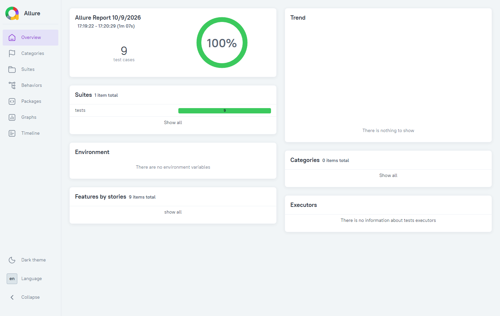
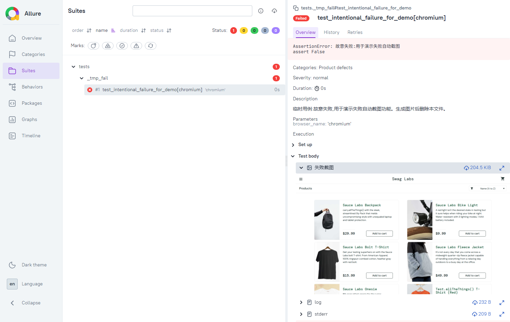

# web-ui-automation

基于 Python + Playwright + pytest 的 UI 自动化测试项目，对 [saucedemo.com](https://www.saucedemo.com/) 的完整下单流程（登录 → 商品 → 购物车 → 结算）做端到端测试。

## 项目特点

- **Page Object 分层**：页面元素与业务动作封装在 `pages/`，用例层只写业务和断言。
- **参数化用例**：登录用例用 `@pytest.mark.parametrize` 覆盖多组账号场景。
- **Allure 报告 + 失败自动截图**：用例失败时自动截图并附加到报告。

## 目录结构

```
web-ui-automation/
├── config/                 # 全局配置（站点地址、测试账号、超时）
│   ├── __init__.py
│   └── settings.py
├── data/                   # 测试数据
│   └── users.json
├── pages/                  # Page Object：页面元素与业务动作
│   ├── __init__.py
│   ├── base_page.py        # 所有页面对象的基类
│   ├── cart_page.py
│   ├── checkout_page.py
│   ├── login_page.py
│   └── products_page.py
├── tests/                  # 测试用例
│   ├── __init__.py
│   ├── test_cart.py
│   ├── test_checkout.py
│   ├── test_login.py
│   ├── test_products.py
│   └── test_smoke.py       # 冒烟测试：确认项目配置能被正常导入
├── utils/                  # 通用工具
│   ├── __init__.py
│   └── logger.py           # 统一日志封装
├── .gitignore
├── conftest.py             # 公共 fixture 与失败自动截图钩子
├── pytest.ini              # pytest 配置
├── README.md
└── requirements.txt
```

## 环境搭建

```bash
python -m venv .venv
source .venv/Scripts/activate
pip install -r requirements.txt
playwright install chromium
```

## 如何运行

```bash
pytest                 # 运行全部用例（无头）
pytest --headed        # 打开浏览器窗口运行
pytest tests/test_login.py   # 只跑登录用例
```

## 查看测试报告

```bash
pytest                 # 结果写入 allure-results/
allure serve allure-results
```

报告概览(9 条用例全部通过、通过率 100%):



用例失败时会自动截图并附加到报告,失败现场一目了然:



## 测试覆盖

| 模块 | 用例文件 | 覆盖点 |
|---|---|---|
| 登录 | test_login.py | 标准用户成功、锁定用户、错误密码 |
| 商品 | test_products.py | 进入商品页、加购角标、按价格排序 |
| 购物车 | test_cart.py | 加购后商品出现在购物车 |
| 结算 | test_checkout.py | 完整下单流程 |
